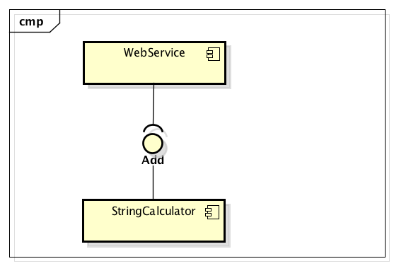

String Calculator: Integration testen en sequence diagrams
==========================================================

Inleiding
---------
In de vorige oefening heb je kunnen zien wat de relatie is tussen unit tests en sequence diagrammen:
* voor vrijwel elke instantie uit het sequence diagram is een unit test
* de klassen werken samen als een functioneel component
* het system sequence diagram beschrijft de interface naar het component toe

Maar wat als dit component gebruikt zou worden door een ander component? Wat als dit component zelf afhankelijk is van een derde component? Welke gevolgen heeft dat voor het testen? In deze vervolg-oefening ontwikkel/krijg je een component voor en na het StringCalculator component zoals je kunt zien in het volgende component diagram:



De klassen waaruit het StringCalculator component bestaan doen er in deze oefening minder toe, er zijn verschillende uitwerkingen van de kata mogelijk maar vrijwel altijd bestaat het component uit meerdere klassen. 

De functionaliteit van de vorige oefening is gelijk gebleven maar er zijn een aantal dingen anders:
* De structuur van het IntelliJ-project is ook anders: elk component zit in een eigen sub-project en levert een eigen jar op, er is een overkoepelende pom.xml waarin de drie componenten samen gebouwd worden.
* De StringCalculator heeft nog dezelfde add-methode maar conform het component diagram implementeert het de Add (hier StringAdder genoemd) interface. Een ander component dat gebruik wil maken van deze functionaliteit hoeft niet te weten hoe het werkt en wie in het component dat regelt, maar moet wel bekend zijn met _wat_ het component kan: zijn "contract" ofwel interface. 
* Alle classes in de package stringcalculator zijn niet meer public, dit keyword is verdwenen. Het gevolg is dat deze classes alleen bruikbaar zijn binnen het package. Er is ook een nieuwe class gemaakt, een zogenaamde "factory" die als vraagpunt kan dienen om een instantie van een StringAdder te krijgen. Hiervoor is ook een unit test aanwezig.  

In deze oefening draaien alle componenten op dezelfde machine en zelfs in dezelfde Java VM, maar zonder al teveel moeite zouden dat drie losse processen kunnen zijn verdeeld over verschillende machines. De webservice is afhankelijk van de stringcalculator. We willen er zeker van zijn dat alle componenten het los doen maar ook dat ze samenwerken met elkaar _en_ hun run-time afhankelijkheden zoals webservers, databases, files, netwerken en randomizers:

_To summarize: an integration test uses real dependencies; unit tests isolate the unit of work from its dependencies so that they’re easily consistent in their results and can easily control and simulate any aspect of the unit’s behavior._ (Osherove, H1 The Art of Unit Testing). 

Stappen
-------
1. Bekijk de unit test van StringAddedFactory en run deze. Je kunt in IntelliJ ook kijken wat de testdekking ("coverage") is, Run Tests with Coverage. Zoek uit hoe je dat kunt doen, voer die actie uit en bekijk de coverage. Het meten van testdekking is erg lastig: we streven naar 100% in OOSE en hebben ook 100% alleen IntelliJ denkt daar anders over (98% line coverage).

2. We bekijken in deze opdracht de componenten als deelsystemen. Maak een system sequence diagram die de wisselwerking laat zien tussen deze deelsystemen. 

3. Bekijk de pom.xml van het webservice-component en beschrijf de verschillen ten opzichte van de pom.xml van de stringwebservice "core". Raadpleeg de Maven-documentatie of stel een vraag op Confluence als je niet goed begrijpt wat sommige secties of tags betekenen. Je hoeft dergelijke files niet van begin af aan te maken, maar begrijpen wat er staat en aanpassingen maken is wel deel van je taak als beginnend softwareontwikkelaar.

4. Run de StringCalculatorWebservice. Voor de webservice is een framework gebruikt (Spring Boot) dat in de main-methode een web-server opstart op poort 8080 en daarin de webservice draait. Je kunt deze webservice dus gewoon benaderen met je browser: http://localhost:8080/add?numbers=1,2,3. Er wordt dan een HTTP-GET gestuurd naar de server, de server zet het request om naar de juiste functie-aanroep en vertaalt het resultaat (een _AddResult_) naar een vorm die gangbaar is voor web-toepassingen, namelijk JSON. Je leert later in OOSE nog hoe je zo'n service zelf bouwt, voor nu focussen we ons op de test.  

5. Maak een _unit test_ voor de add-methode van de StringCalculatorService (we hebben hier klaarblijkelijk niet TDD gewerkt :flushed:). Test alleen met de input "1,2,3,4"; we kunnen heel veel andere input gebruiken maar de testgevallen zijn vrijwel gelijk aan die van de core. Gebruik voor nu in deze testcase de parameterloze constructor waardoor de factory gebruikt wordt. 

6. In de vorige stap hebben we niet alleen de add-functie van de StringCalculatorService getest maar ook zijn _dependencies_. Stel dat de vorige test een fout aan het licht gebracht had, waar moeten we dan gaan zoeken? De fout kan in de webservice, zijn afhankelijkheden, de afhankelijkheden van de afhankelijkheden etc. zitten. Voor een goede _unit_ test zouden we de webservice willen testen, ervan uitgaande dat de core correct werkt. Hiervoor gaan we gebruik maken van een "mock", een vorm van een test-double (voor meer info zie de verdere bronnen). Voeg in de pom.xml van de webservice de volgende dependency toe:

    ```xml
    <dependency>
        <groupId>org.mockito</groupId>
        <artifactId>mockito-all</artifactId>
        <version>2.0.42</version>
        <scope>test</scope>
    </dependency>
    
    ```

    Met Mockito kunnen we de StringCalculator nadoen of "fixeren" zoals dat in test-terminologie heet. Verbeter je test door gebruik te maken van de andere constructor van StringCalculatorService en voer de volgende aanpassingen door: 
    Voeg de volgende annotatie toe net voor ```public class```:
    
    ```java
    @RunWith(MockitoJUnitRunner.class)

    ```
    
    Voeg een attribuut toe aan de StringCalculatorServiceTest:
    
    ```java
    @Mock
    StringAdder stringCalculator;
    ```
    
    Voeg het volgende stukje code toe aan het begin van de body van jouw test-functie net voor het creeren van de instantie van de service en geef de gemockte stringCalculator mee aan de constructor en run de unit-test. 
    
    ```java
    when(stringCalculator.add("1,2,3,4")).thenReturn(10);
    ```
    
    Voeg deze regel toe aan het einde van de body van jouw test-functie:
    
    ```java
    verify(stringCalculator).add("1,2,3,4");
    ```
    
    Pas indien nodig ook de import-statements aan om de mock- en verify methoden te kunnen gebruiken.
    
7. Als het goed is slaagde je unit-test, je hebt nu alleen de webservice ge-unit-test zonder zijn afhankelijkheden maar wel voor 1 specifiek geval. Probeer maar eens wat er gebeurt als je een nieuwe testcase toevoegt voor "1,2,3,4,5" :grin:. Kortom, deze testcase slaagt alleen als de webservice iets teruggeeft wat bepaald wordt door de mock _en_ als de mock daadwerkelijk met bepaalde waarden wordt aangeroepen. Soms heb je geen return waarde bij een functie, dan kun je geen assertEquals uitvoeren maar met verify wel checken of een functie op een dependency is aangeroepen. 

8. De hebben de webservice eerder aangeroepen en kregen JSON terug, daar zorgt de webserver samen met het framework (Spring Boot) voor. Om te testen of dat als geheel goed werkt hebben we een integratietest nodig. Op [Spring Boot Tutorial](http://www.springboottutorial.com/integration-testing-for-spring-boot-rest-services) vind je een voorbeeld van een integratietest voor een GET (de broncode onder "Integration Testing the Get Rest Service"). Pas deze aan:
    * verander de classes=StudentServicesApplication.class naar classes=StringCalculatorService.class
    * verander URL "/students/Student1/courses/Course1" naar "/add?numbers=1,2,3,4"
    * verander de waarde van de variabele expected naar een JSON-representatie van het antwoord dat jij verwacht 

9. Voer de test uit. Je ziet in de logging dat er veel gebeurt, o.a. het opstarten van een server, het luisteren naar een poort etc. Deze test doet er langer over dan een unit test maar is nog enigzins overzichtelijk, wanneer de stringcalculator nog een veelvoud van afhankelijkheden zou hebben zoals een database of een aanroep naar een andere applicatie dan is deze test te traag om vaak te runnen. Hiervoor zijn verschillende oplossingen waarbij je kunt spelen met de naamgevingsconventie van test-files en mogelijkheden die Maven biedt, maar die vallen voor nu buiten beschouwing. 

10. Je hebt nu verschillende tests gemaakt, maar ook verschillende momenten gezien waarop je ze kunt toepassen. In TDD volg je de cyclus tot dat alle _units_ getest zijn. Je hebt gezien dat je daarmee 100% coverage kunt krijgen maar dat je in TDD na het refactoren voor je het weet de combinatie van classes test, hiervoor zijn mocks of stubs handig. Als alle units los en samen werken zijn integratietests de laatste stap om de combinatie te testen met alle run-time afhankelijkheden.

Met een system sequence diagram kun je relaties tussen deelsystemen of componenten in kaart brengen en bekijken welke interfaces er zijn tussen die componenten. Deze kun je gebruiken voor het los en geintegreerd testen van classes en componenten. In geval van een webservice is het geen gek idee om de systeem operaties uit de SSD uit te drukken in URLs, GET/POSTS en voorbeeld-JSON-responses. 
 
Verdere bronnen
---------------
[Spring Boot Tutorial](http://www.springboottutorial.com/integration-testing-for-spring-boot-rest-services)

[Hoofdstuk 1 van Osherove's boek over unit- en integratietesten](https://onderwijsonline.han.nl/manage/content/lessonfile/5y2A1ONw/eyJpdiI6Ikh4bnlCQzU0QzRQYmxudUpjMk1Ud2c9PSIsInZhbHVlIjoiM0NzbVN4K1ZlNTRCWWF2Yys5eDlTK0p6OURubCtlVENWb2VNeDlmQ3hVdnAyNkRnXC9DV203NG1SNVpGMnVQYjkiLCJtYWMiOiJiZDYwMzBlZmY2N2E4YjhhZWU0MjY3NmI1ZjU4NTRiYTJmMzk0YjA1NmFiYTQ4ZjNjNjMwMjIwOTFjODZmYmUyIn0=) 
[Mocks aren't stubs](https://martinfowler.com/articles/mocksArentStubs.html)

[Test doubles](https://adamcod.es/2014/05/15/test-doubles-mock-vs-stub.html)

